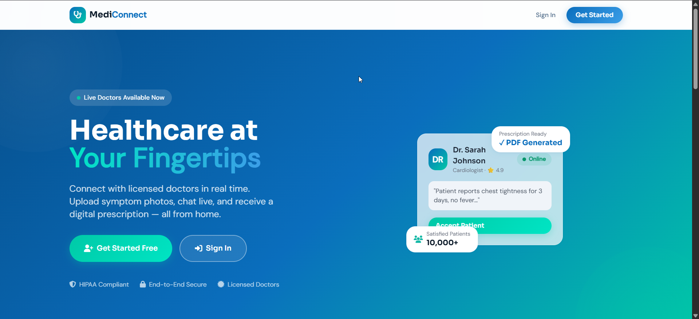
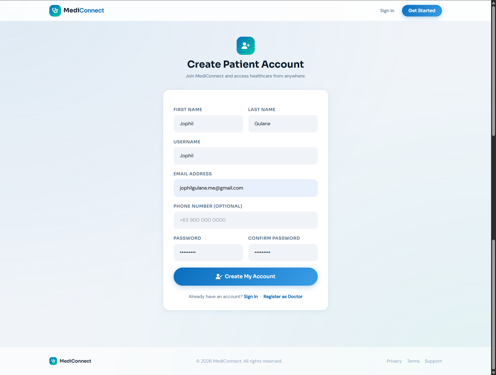
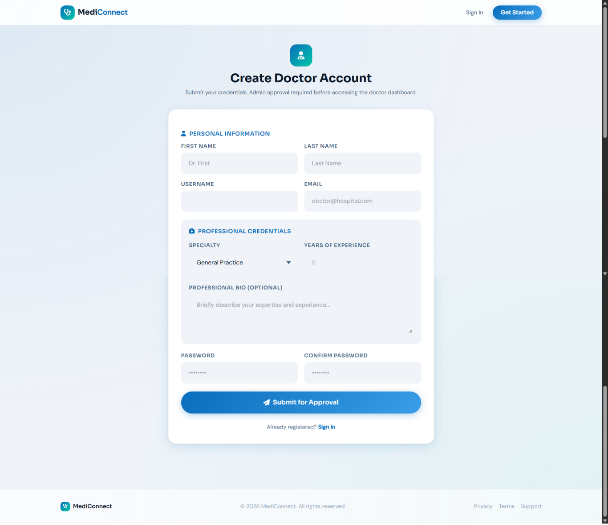
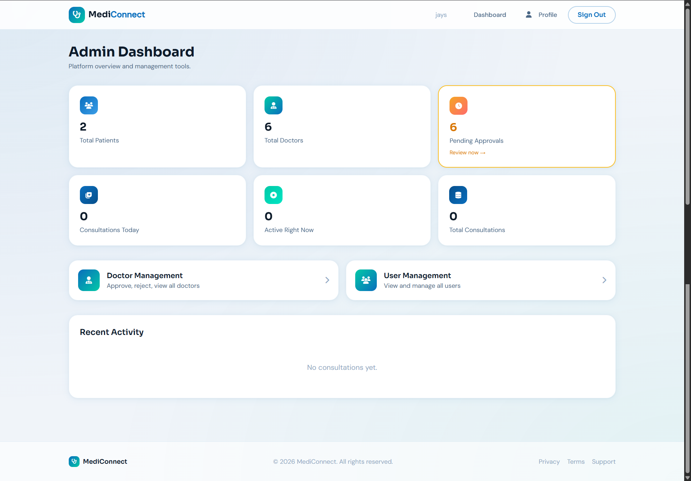
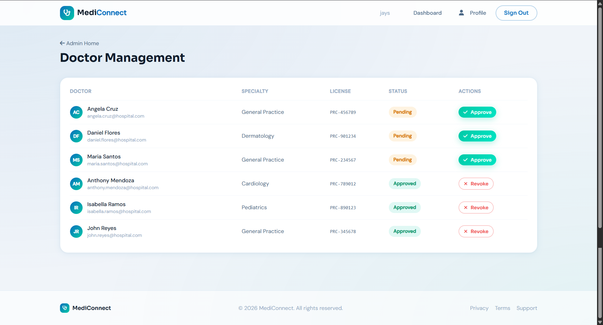
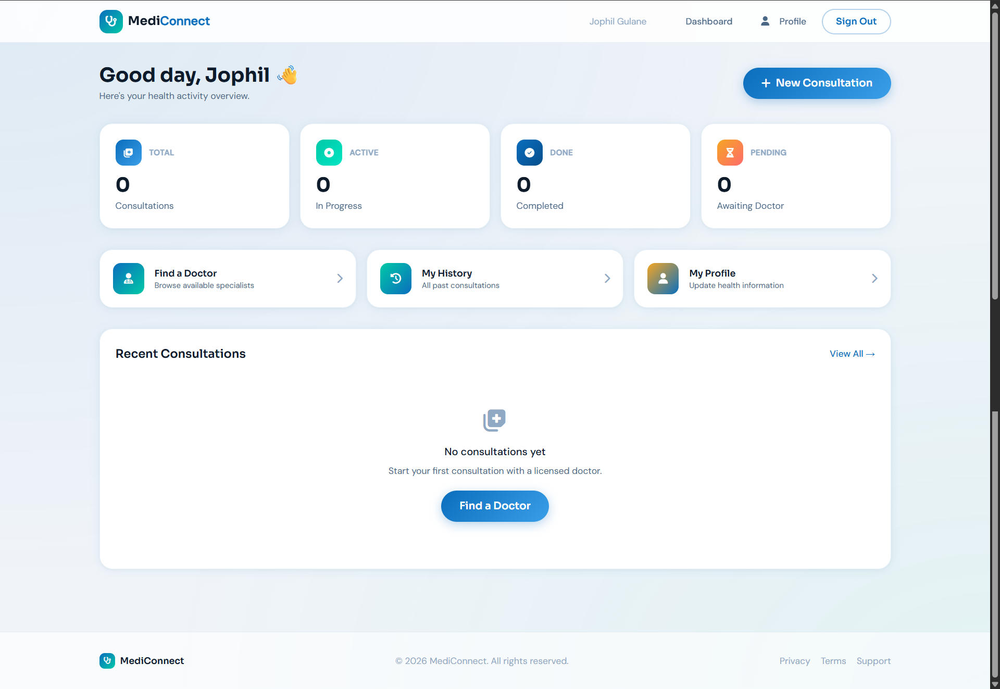
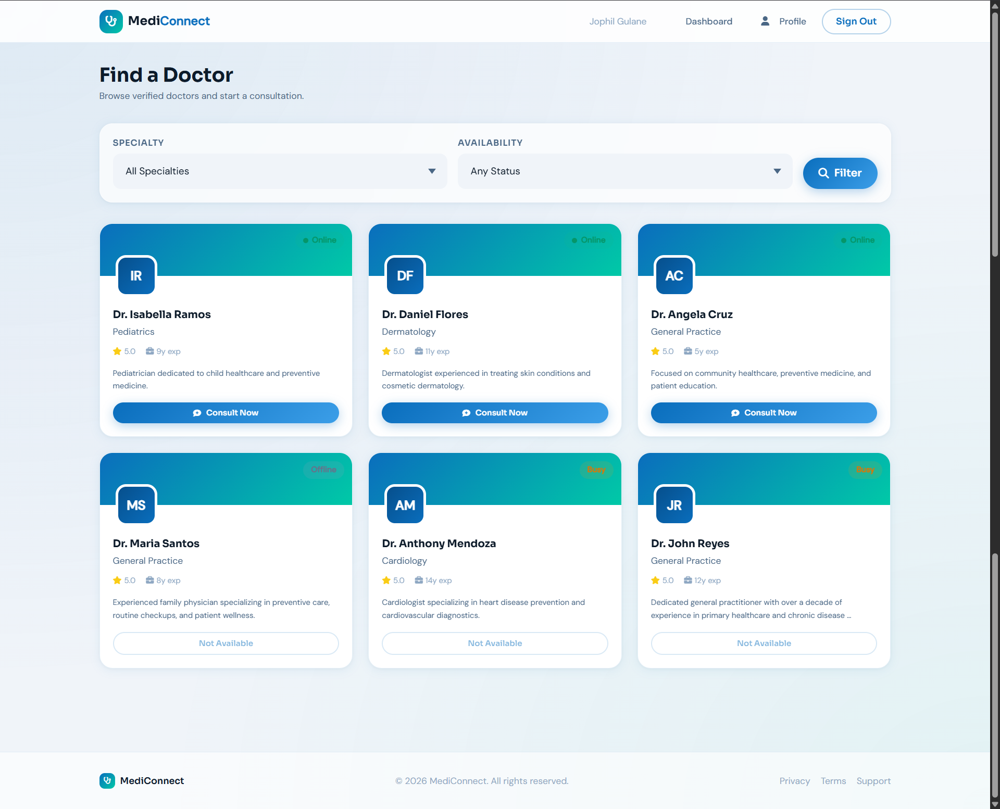
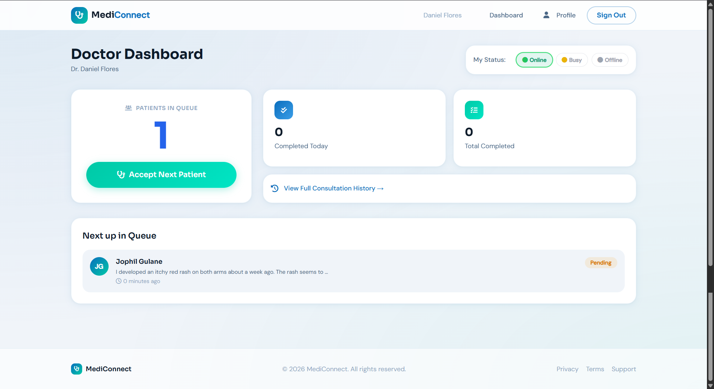

# MediConnect — Online Consultation System

> A Django-based telemedicine platform that connects patients with licensed doctors for real-time online consultations, symptom reporting, and digital prescription generation.

---

## Project Information

| Field | Details |
|-------|---------|
| Subject | System Integration and Architecture (SIA) |
| Academic Year | 2025–2026 |
| Project Category | Web Development |
| Instructor | Ma'am Divine Grace Caabay |

### Members

* Jophil F. Gulane
* Vougne Froid P. Alis
* Dianara Kristy D. Garciano
* Ross Ivan T. Venturillo

---

## Project Description

MediConnect is a web-based telemedicine platform designed to bridge the gap between patients and licensed medical professionals through seamless online consultations. The system allows patients to register, describe their symptoms, browse available doctors by specialty, and initiate real-time chat consultations — all from a single platform.

Doctors can manage their availability status, accept incoming patient consultations, view patient medical history during sessions, and generate downloadable digital prescriptions in PDF format upon completing a consultation. An admin dashboard provides full oversight of the platform, including the ability to approve or reject incoming doctor registration requests, monitor active consultations, and manage all users.

The project was built to address healthcare accessibility challenges — particularly for patients in remote areas who may not have easy access to in-person medical care. It integrates Django Channels and Daphne (ASGI) for real-time WebSocket-powered chat, ensuring smooth and responsive communication between patients and doctors.

---

## Features

* **Patient Registration & Profiles** — Patients can create accounts, fill in health info (blood type, allergies, medical history), and upload a profile picture
* **Doctor Registration with Admin Approval** — Doctors submit credentials and license numbers; accounts are only activated after admin verification
* **Browse Doctors by Specialty** — Patients can filter and search doctors by medical specialty and availability status
* **Real-Time Chat Consultation** — WebSocket-powered live messaging between patient and doctor during an active consultation
* **Image Attachment** — Patients can upload symptom photos directly inside the chat room during consultations
* **Digital Prescription Generation** — Doctors can write prescriptions with medicine details, dosage, and instructions; a downloadable PDF is generated for the patient
* **Doctor Availability Status** — Doctors can toggle their status (Online / Busy / Offline) from their dashboard
* **Patient Queue System** — Doctors see a live queue of waiting patients and can accept the next consultation with one click
* **Admin Dashboard** — Full platform overview with stats on patients, doctors, pending approvals, and active consultations
* **Consultation History** — Both patients and doctors can view their full consultation history with status tracking and prescription links
* **Responsive Design** — "Clinical Luxury" UI design system built with Tailwind CSS utility classes and custom CSS tokens, optimized for both desktop and mobile

---

## Technologies Used

* **Python 3.11** — Core programming language
* **Django 4.2** — Web framework
* **Django Channels 4** — WebSocket support for real-time chat
* **Daphne (ASGI)** — Async server for running Django Channels
* **PostgreSQL** — Production database (via Railway)
* **SQLite** — Local development database
* **ReportLab** — PDF generation for digital prescriptions
* **Pillow** — Image processing and validation for uploaded symptom photos
* **WhiteNoise** — Static file serving in production
* **django-widget-tweaks** — Template-level form field customization
* **dj-database-url** — Database URL parsing for Railway deployment
* **python-dotenv** — Environment variable management
* **Railway** — Cloud hosting and PostgreSQL database
* **HTML / CSS / JavaScript** — Frontend templates and real-time UI interactions
* **Font Awesome 6** — Icon library
* **Google Fonts (Sora, DM Sans)** — Typography

---

## Installation Guide

### Prerequisites
* Python 3.11+
* Git

### Steps

1. Clone the repository

```bash
git clone https://github.com/PSU-CS-Academic-Projects/MediConnect-Online-Consultation-System.git
```

2. Navigate into the project folder

```bash
cd MediConnect-Online-Consultation-System
```

3. Create and activate a virtual environment

```bash
# Windows
python -m venv venv
venv\Scripts\activate

# macOS / Linux
python3 -m venv venv
source venv/bin/activate
```

4. Install dependencies

```bash
pip install -r requirements.txt
```

5. Create your environment file — copy the example below and save it as `.env` in the project root

```env
DJANGO_SECRET_KEY=your-secret-key-here
DJANGO_DEBUG=True
DJANGO_ALLOWED_HOSTS=localhost,127.0.0.1
MAX_UPLOAD_SIZE_MB=5
```

> Generate a secret key by running:
> ```bash
> python -c "from django.core.management.utils import get_random_secret_key; print(get_random_secret_key())"
> ```

6. Run database migrations

```bash
python manage.py migrate
```

7. Create a superuser (admin account)

```bash
python manage.py createsuperuser
```

8. Collect static files

```bash
python manage.py collectstatic
```

9. Start the development server

```bash
python manage.py runserver
```

10. Open your browser and go to `http://127.0.0.1:8000`

---

## Screenshots

> Screenshots are located inside the `screenshots/` folder.

**Home / Landing Page**



**Patient Registration**



**Doctor Registration**



**Admin Dashboard**



**Doctor Approval Management**



**Patient Dashboard**



**Browse Doctors**



**Consultation Room (Real-Time Chat)**


**Doctor Dashboard**



**Digital Prescription**


---

## Live Demo

* **Live URL:** https://mediconnectpsu.up.railway.app

---

## Video Demonstration

* Video Link: https://your-video-link-here.com *(Optional — update when available)*

---

## Future Improvements

* **Video Consultation** — Integrate WebRTC for in-browser video/audio calls between patient and doctor
* **Cloudinary Media Storage** — Migrate uploaded images to Cloudinary for persistent cloud storage across deployments
* **Push Notifications** — Real-time browser notifications for new consultations, messages, and prescription readiness
* **Appointment Scheduling** — Allow patients to book future appointments instead of walk-in queue only
* **Mobile Application** — Develop a companion mobile app using Flutter or React Native for on-the-go access
* **Multi-language Support** — Add Filipino (Tagalog) and Cuyonon language support for broader accessibility
* **Rating & Review System** — Allow patients to rate doctors after completed consultations
* **Analytics Dashboard** — Enhanced admin reporting with charts for consultation trends and doctor performance
